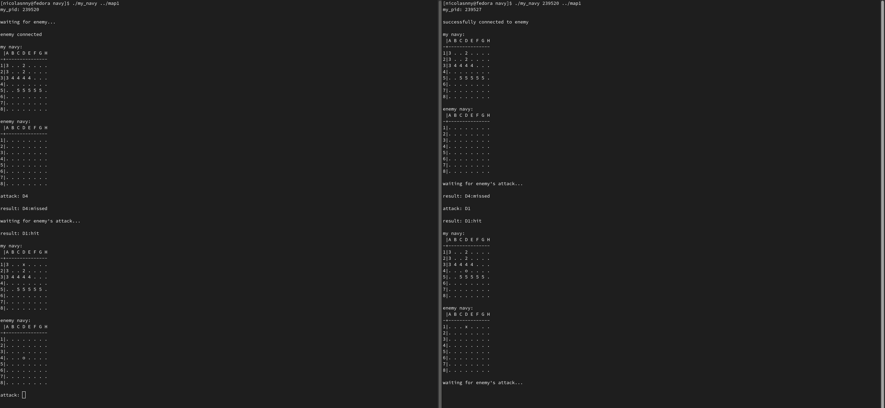

# My Navy

My Navy is a recreation of the classic Battleship game. The game features an 8x8 board and is initialized using a file as an argument containing the coordinates of the boats on the board.

## File Format
Example of the content of a file:

```
2:D1:D2
3:A1:A3
4:B3:E3
5:C5:G5
```

These represent the positions of the ships, with sizes of 2, 3, 4, and 5.

## Compilation
```
make
```

## Usage
To play My Navy, follow these steps:

1. **First Player:**
   ```
   ./my_navy [map1]
   ```

2. **Second Player:**
   ```
   ./my_navy [PID of the first terminal] [map2]
   ```

If you make an out-of-range attack or attack a place you have already attacked, you will lose the turn. The game ends whenever all of the ships of any of the players have been defeated.

